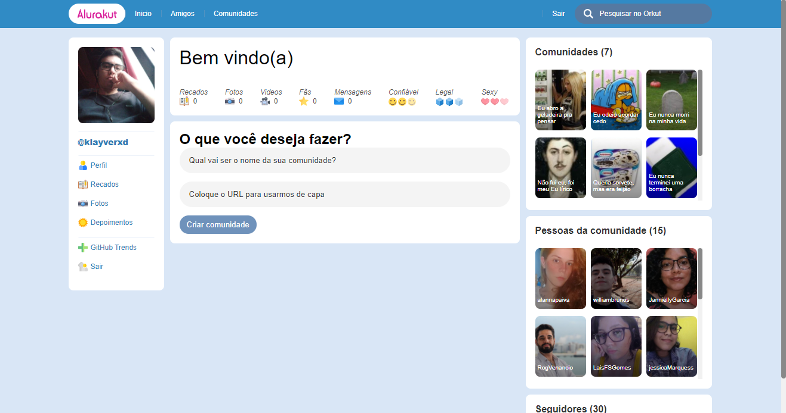
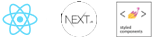

<div align="center">
  
</div>

## Alurakut

[](https://github.com/klayverxd)
[](#)
[](https://reactjs.org)
[](https://reactjs.org)

<h4 align="center">
  Alurakut é uma aplicação baseada na antiga rede social Orkut.
</h4>



## 🧪 Tecnologias
<div align="center">
  <br />
  
</div>

Este projeto foi desenvolvido usando as seguintes tecnologias:

- [ReactJS](https://reactjs.org)
- [NextJS](https://nextjs.org)
- [Styled Components](https://styled-components.com)

## 🚀 Deploy da aplicação com Vercel

> https://alurakut-kx.vercel.app/

## 👨🏽‍💻 Inicialização local

### Requerimentos

- Você precisa instalar tanto o [Node.js](https://nodejs.org/en/download/) e [Yarn](https://yarnpkg.com/) para executar esta aplicação.

**No terminal, clone o projeto e acesse a pasta da aplicação**

```bash
$ git clone https://github.com/klayverxd/alurakut.git && cd alurakut
```

**Siga os passos abaixo:**
```bash
# Instalar as dependências
$ yarn
# Iniciar o front-end
$ yarn dev
```

A aplicação poderá ser acessada localmente em `http://localhost:3000`

## 📕 API de referência - Github

[Github API](https://docs.github.com/en/rest)

## 🔖 Layout

Você pode ver o layout do projeto no Figma no link abaixo:

- [Layout](https://www.figma.com/file/xHF0n0qxiE2rqjqAILiBUB/Alurakut?node-id=58%3A0) 

Lembrando que você precisa ter uma conta no [Figma](http://figma.com/) para poder acessar.

